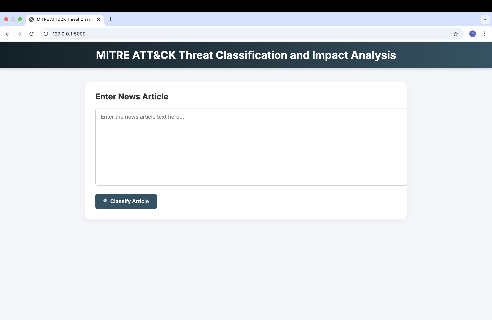
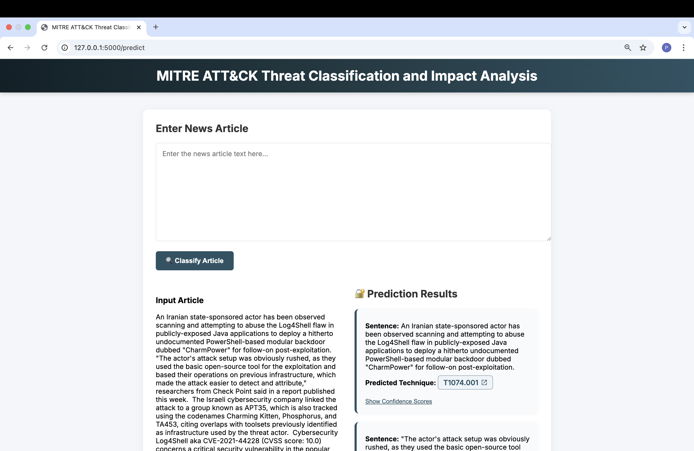

# AI System For MITRE ATT&CK Threat Classification

## Overview

This project aims to develop an AI-powered system that leverages Natural Language Processing (NLP) to automatically classify cybersecurity news articles into MITRE ATT&CK techniques. The system utilizes a fine-tuned BERT model to automate the classification process, helping organizations analyze cybersecurity threats more effectively and reduce the manual effort involved in mapping security incidents to the MITRE ATT&CK framework.

## Key Features

- **Automated Threat Classification:** The system automatically classifies cybersecurity news articles based on MITRE ATT&CK techniques.

- **Fine-Tuned BERT Model:** The model is fine-tuned specifically for cybersecurity news, enabling it to handle complex attack descriptions and terminology.

- **Web-Based Interface:** A user-friendly web interface to interact with the system, allowing security analysts to input cybersecurity news articles and receive classified MITRE ATT&CK techniques.

## Related Works

This research builds on several notable works in the field of cybersecurity threat intelligence and natural language processing (NLP):

**1. Pre-trained Models and Classification Frameworks**

- **CTI-BERT (Park and You, 2023):** A pre-trained model for Cyber Threat Intelligence (CTI) that outperforms general models in MITRE ATT&CK classification but faces challenges like limited dataset size and language coverage.

- **Full-Stack NLP Pipeline (Park and Lee, 2022):** Extracts threat intelligence from unstructured text but lacks direct integration with MITRE ATT&CK, making it less efficient for classification tasks.

**2. Handling Multi-Label Challenges**

- **Noise Contrastive Estimation (NCE) (Nguyen et al., 2024):** A framework to handle multi-label challenges and missing annotations, showing better performance in MITRE ATT&CK classification.

- **Sentence-Level Classification (Orbinato et al., 2022):** Explores deep learning for classifying unstructured CTI, outperforming traditional approaches at the sentence level.

**3. Cybersecurity Datasets and Entity Extraction** 

- **AnnoCTR Dataset (Lange et al., 2024):** Provides annotated threat reports linked to MITRE ATT&CK, useful for training classification models.

- **CySecED Dataset (Trong et al., 2020):** Expands on earlier datasets with broader event types but struggles with complex attack dependencies.

- **Named Entity Recognition (NER):** Used to identify and classify entities like malware and attack techniques, improving threat classification accuracy.

**4. Context-Aware Modeling**

- **Context-Guided BERT (Wu and Ong, 2020):**  Uses a quasi-attention mechanism to enhance the model's understanding of relationships between parts of a sentence. This helps capture both positive and negative relationships, improving the mapping of attacks to MITRE ATT&CK techniques.

## Methodology

### Old Work Flow

1. Manual Search for Threat Information
2. Human Judgment & Filtering
3. Threat Identification
  - Technique & Tactic Extraction: aligned with frameworks like MITRE ATT&CK
  - Pattern Matching
  - Notify Security Teams
  - Mitigation Planning
    


### New Work Flow

1. Select Models for Comparison. Three models selected for comparison are: BERT-Base-Uncased, CTI-BERT and Secure-BERT
2. Tokenizer and Word Embeddings
3. Training the Models: train 3 models with the same dataset and turn hyperparameters
4. Evaluate Performance
5. Select the Best Model
6. Utlized the QACG-BERT with previous trained model
7. Pre-process the News or Articles
8. Evaluation: A predifined groud truth will be used to evluate the classification results 


## Results

This section presents the results from experiments evaluating the performance of various BERT-based models in classifying cybersecurity-specific dataset into MITRE ATT&CK techniques. The models evaluated were:

- **BERT-base-uncased**
- **CTI-BERT**
- **Secure-BERT**

After that, the datasets will be modified to add the context inside which according to the QACGBERT model for evluating with groud truth.

### Standard Classification Metrics

The table below summarizes the performance of the four models based on the metrics mentioned:

| Metric              | BERT-base-uncased | CTI-BERT | Secure-BERT |   QACGBERT  |
|---------------------|-------------------|----------|-------------|-------------|
| **Training Loss**   | 3.58              | 2.77     | 3.58        | 1.71        |
| **Validation Loss** | 3.44              | 2.71     | 3.31        | 4.72        |
| **Accuracy**        | 43.76%            | 54.64%   | 44.45%      | 16.81%      |
| **Precision**       | 29.21%            | 43.17%   | 29.98%      | 16.31%      |
| **Recall**          | 43.76%            | 54.64%   | 44.45%      | 16.81%      |
| **F1-Score**        | 33.35%            | 46.61%   | 33.71%      | 14.44%      |


### Normalized Discounted Cumulative Gain (NDCG) Metric

The groud truth will be evluated base on ChatGPT classification with 10 samples on news or articles.


| Metric                     | CTI-BERT | QACGBERT |
|----------------------------|--------- |----------|
| **NDCG Score wit k = 20**  | 0.0000   | 0.0163   | 


## Datasets

**[tumeteor/Security-TTP-Mapping](https://huggingface.co/datasets/tumeteor/Security-TTP-Mapping):** A dataset mapping security text to Tactics, Techniques, and Procedures (TTPs) to help identify attack patterns.


## Repository Description
- This repository consist of model training, evaluation ,and website deployment. Here are some explanation about each component:

**1. Model Training**
<br>Model training could access through .ipynb which are:
- NLP_project_BERT.ipynb
- NLP_project_CTI-BERT.ipynb
- NLP_project_QACG_bert_cti_modified.ipynb
- NLP_project_SecureBERT.ipynb


**2. Evaluation**
<br>For evluation, the comparion between 2 ipynb file are NLP_project_CTI-BERT.ipynb and evaluation_bert.ipynb. Both files will use the real_news_maps.csv as the groud truth for evluating the model.


**3. Website Deployment**  
The web-based interface allows users to interact with the trained model. Security analysts can input unstructured cybersecurity news articles and receive classified MITRE ATT&CK techniques, demonstrating the system’s practical application.

## Setup and Running the Application

**1. Clone the repository:** 
Clone the repository to your local machine.
```bash
git clone https://github.com/MrWhiteC/NLU_Project2025.git
cd app
```

**2. Running the Flask App:**
To start the Flask web application, run the following command:
```bash
python app.py
```
This will start the app on `http://127.0.0.1:5000/`.

## Features of the Web Application
- **Text Classification**: Users can input a cybersecurity news article, and the model will classify it into relevant MITRE ATT&CK techniques based on its content.
  
- **Interactive Interface**: A simple text box is provided for entering the article text, with a 'Classify Article' button to trigger the classification process.

- **Contextual Mapping**: The model analyzes the input text and maps it to specific MITRE ATT&CK techniques.
  
- **Real-Time Results**: The predicted MITRE ATT&CK techniques are displayed immediately below the input box, allowing users to view the classification results instantly.

## Web Application Sample Screenshots

**Screenshot 1: Homepage**



**Screenshot 2: Text Classification Sample Output**



## Limitations and Challenges
- **Accuracy Issues: Low accuracy due to**:
  - Insufficient or imbalanced dataset.
  - Overfitting and model’s difficulty generalizing to new attack types.

- **Complex Attack Descriptions**: Variability in attack styles and terminologies.

- **Data Quality & Size**: Inadequate coverage of attack techniques, poor learning of certain attack behaviors.

- **Language Limitation: Currently only supports English**, restricting global usability.


## Conclusion & Future Works
- **Conclusion:** The primary goal of this research was to reduce the manual effort required for analyzing cybersecurity news and improve the consistency and accuracy of threat classification. While the system shows potential, the current low accuracy, particularly during the evaluation phase, highlights the need for further development. The model can understand the context and language of cybersecurity news, but it still needs more improvement to ensure reliable and consistent threat detection. Moving forward, improving the model’s accuracy remains a crucial focus, which will enhance its practical application in real-world cybersecurity scenarios..

- **Future Works :**
  - Expand Dataset: Include more types of attacks, descriptions, and tough examples for robustness.
  - Fine-tune Model: Use more specific cybersecurity data for better understanding.
  - Multilingual Support: Add support for different languages to broaden system’s applicability.
  - Integration with Live Threat Feeds: Real-time classification of new threats by adapting to evolving attack methods.


